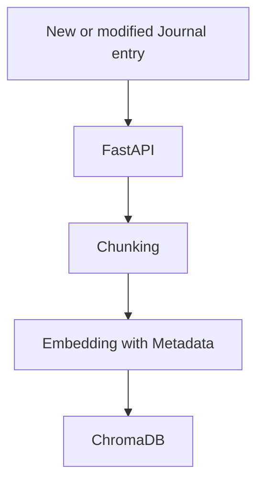
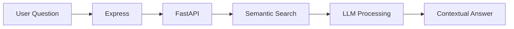

# 📝 Journal Journey - AI-Powered Reflective Journal

| Dark Theme | Light Theme |
| ------ | ------ |
|  |  |

---
## ✨ Features
- **Conversational Journal Search** - Ask questions in natural language about past entries
- **Specific Tag Search** - Retrieve journal entries with specific tag/tags
- **Automatic Tag Suggestion** - Dynamically generates tags in real-time as the user types, using keyword extraction from the content input
- **Timeline** - Visualize Journal Journey with dynamic year-timeline
- **CRUD Functionality** - Create, Manipulate, and Query journal entries
- **CI/CD using GitHub Actions** - Containerized with **Docker** and Deployed on **Render** 
- **Light and Dark Mode** - Personalized user interface experience with light and dark mode options.

| Chatbox | Tag Search |
| ------ | ------ |
|  <br>  |  |

| Create | View | Edit |
| ------ | ------ | ------ |
|  |  |  |

---
## 🛠 Tech Stack
### Frontend
- React (Vite) + JavaScript
- Context API (State Management)

### Backend
- Express.js
- MongoDB + Mongoose (Journal Storage)

### RAG Microservice
- FastAPI (Python ML Service)
- LangChain (Content Processing)
- ChromaDB (Vector Store)
- GPT-4o LLM(Conversational AI)

### Keyword Extraction
- GPT-4o LLM with Sonar-Reasoning as fallback model

---
## ⚙️ Conversational RAG Architecture
### RAG processing Journal data


### User query handling


---
## Run the App Locally

1. Clone the repository

2. Navigate to the project directory
    ```bash
    cd Journal-App-Fullstack-RAG
    ```

3. Set up Frontend
    ```bash
    cd frontend
    ```
   * App.jsx under ./src
        * For development BASE_URL, set VITE_BASE_URL = http://127.0.0.1:5000 under .env in the frontend root folder
        * For Vite, import statement: import.meta.env.VITE_BASE_URL
        * For production BASE_URL, set VITE_BASE_URL = https://repo-name.onrender.com under environmental variables on Render 
   
   * Note:  'npm run build' command generated build output in '../backend/dist' folder, as backend is configured to serve React static files. Change output directory (outdir) if necessary.

    ```bash
    npm install
    npm run build
    ```

5. Set up Backend
    ```bash
    cd ../backend
    python3 -m venv venv
    venv\Scripts\activate   ## on MacOS and Linux : source venv/bin/activate
    pip install -r requirements.txt
    ```
    ```bash
    npm install

    nodemon server.js 
    or 
    node server.js
    ```
    * .env in the backend root folder should contain the following
        * DB_PASSWORD, DB_USERNAME: MongoDB password and username
        * PORT=5000
        * RAG_MICROSERVICE_BASE_URL=http://localhost:8000

6. Set up Rag Microservice
    ```bash
    cd ../microservice
    python3 -m venv venv
    venv\Scripts\activate   ## on MacOS and Linux : source venv/bin/activate
    pip install -r requirements.txt

    python -u app.py --reload
    or
    uvicorn app:app --host 127.0.0.1 --port 8000

    ```

7. Open browser and go to `http://localhost:5000/` to view the application


### Run services
docker-compose up -d  # or start each service manually

---
## Acknowledgements
The base structure of this project is inspired by : [Coding with Kevin](https://www.youtube.com/watch?v=D9ByRLPg-J4&list=PLZ81O7amWFO_WotG-TJfjfi3YlSbShPS7&ab_channel=CodingwithKevin)

